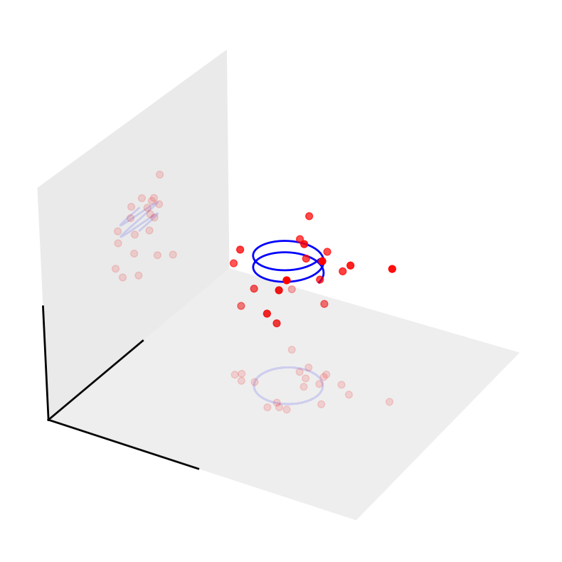
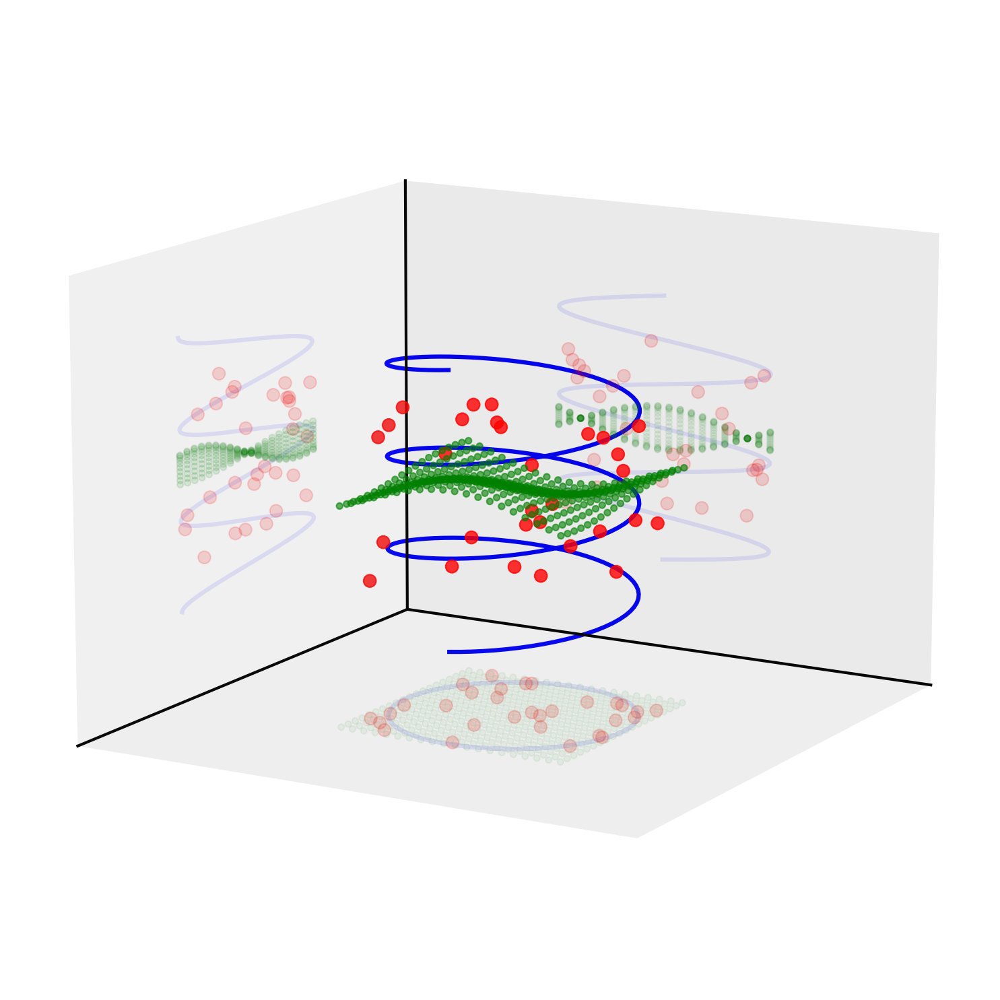

# Plot3DShadows

A Python package for creating beautiful 3D plots with automatic shadows projected onto coordinate planes using matplotlib.

## Example Plots

### Basic Example


### Advanced Example



## Features

- **Automatic Shadow Generation**: Automatically projects 3D data onto coordinate planes as shadows
- **Customizable Shadow Planes**: Choose which coordinate planes to show shadows on (xy, xz, yz)
- **Flexible Shadow Positioning**: Control whether shadows appear at the minimum or maximum of each axis
- **Easy Integration**: Simple wrapper around matplotlib's 3D plotting capabilities
- **Customizable Appearance**: Control shadow transparency and other visual properties

## Installation

### From PyPI (when published)
```bash
pip install plot3dshadows
```

### From Source
```bash
git clone https://github.com/KabirDabholkar/plot3dshadows.git
cd plot3dshadows
pip install -e .
```

## Usage

### Basic Usage

The `Plot3DShadows` class wraps a matplotlib 3D axis and provides methods for plotting with automatic shadows:

```python
from plot3dshadows import Plot3DShadows

# Initialize with a matplotlib 3D axis
plotter = Plot3DShadows(ax)

# Plot data (shadows are stored but not plotted yet)
plotter.plot(x, y, z, color='blue')
plotter.scatter(x, y, z, color='red', s=50)

# Plot all shadows at once
plotter.plot_shadows()
```

### Configuration Options

#### Shadow Planes
Choose which coordinate planes to show shadows on:

```python
# Show shadows on all planes (default)
plotter = Plot3DShadows(ax, shadow_planes=['xy', 'xz', 'yz'])

# Show shadows only on xy and xz planes
plotter = Plot3DShadows(ax, shadow_planes=['xy', 'xz'])
```

#### Shadow Positions
Control whether shadows appear at the minimum or maximum of each axis:

```python
# Shadows at minimum values (default)
plotter = Plot3DShadows(ax, shadow_positions={'xy': 'min', 'xz': 'min', 'yz': 'min'})

# Shadows at maximum values
plotter = Plot3DShadows(ax, shadow_positions={'xy': 'max', 'xz': 'max', 'yz': 'max'})

# Mixed configuration
plotter = Plot3DShadows(ax, shadow_positions={'xy': 'min', 'xz': 'max', 'yz': 'min'})
```

#### Shadow Transparency
Control the transparency of shadows relative to the original plots:

```python
# Shadows at 30% of original alpha (default)
plotter = Plot3DShadows(ax, shadow_alpha_ratio=0.3)

# Shadows at 50% of original alpha
plotter = Plot3DShadows(ax, shadow_alpha_ratio=0.5)
```

### Advanced Features

#### Per-Plot Shadow Control
Override shadow settings for individual plots:

```python
# Use different shadow alpha for this specific plot
plotter.plot(x, y, z, color='blue', shadow_alpha_ratio=0.5)

# Use default shadow alpha for this plot
plotter.scatter(x, y, z, color='red', shadow_alpha_ratio=None)
```

#### Additional Plotting Methods

```python
# Plot coordinate axes
plotter.plot_axes(partial=0.5)  # partial=1 shows full axes

# Plot coordinate planes
plotter.plot_planes()

# Set labels and title
plotter.set_labels('X Axis', 'Y Axis', 'Z Axis')
plotter.set_title('My 3D Plot')

# Update shadow positions dynamically
plotter.set_shadow_positions({'xy': 'max', 'xz': 'min'})
```

## Examples

See the `examples/` directory for complete working examples:

- `examples/basic_example.py` - Simple 3D spiral with shadows
- `examples/advanced_example.py` - Scatter plot with custom shadow configuration

## API Reference

### Plot3DShadows

The main class for 3D plotting with shadows.

#### Constructor

```python
Plot3DShadows(ax, shadow_alpha_ratio=0.3, shadow_planes=['xy', 'xz', 'yz'], 
              shadow_positions={'xy': 'min', 'xz': 'min', 'yz': 'min'})
```

**Parameters:**
- `ax`: matplotlib.axes.Axes3D - The 3D matplotlib axis object
- `shadow_alpha_ratio`: float - Ratio to multiply original alpha by for shadows (default: 0.3)
- `shadow_planes`: list - List of shadow planes to plot (default: ['xy', 'xz', 'yz'])
- `shadow_positions`: dict - Shadow positions for each plane (default: {'xy': 'min', 'xz': 'min', 'yz': 'min'})

#### Methods

- `plot(x, y, z, shadow_alpha_ratio=None, **kwargs)`: Plot 3D lines
- `scatter(x, y, z, shadow_alpha_ratio=None, **kwargs)`: Plot 3D scatter points
- `plot_shadows()`: Plot shadows for all accumulated data
- `set_labels(xlabel, ylabel, zlabel)`: Set axis labels
- `set_title(title)`: Set plot title
- `set_shadow_positions(shadow_positions)`: Update shadow positions
- `plot_axes(partial=1)`: Plot coordinate axes
- `plot_planes()`: Plot coordinate planes